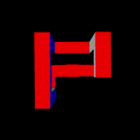

  

# Py3dGame

Py3dGame is a simple 3D engine built on top of pygame.
Currenlty is in the early stages of development, but the first release will be out soon.

## ❓Why Py3dGame is born❓

Py3dGame originated as a personal project driven by the sheer joy of coding and the desire to enhance my skills. I acknowledge that Python might not be the optimal programming language for constructing a game engine, given its relatively slower performance. Nevertheless, as my primary objective is to learn and I thoroughly enjoy programming in Python, this limitation doesn't bother me.

## Features wishlist

Here, a really optimistic features that I would like to implement in the feature:

- 🌒 shadows handling
- ⚛️ physics engine
- 🤖 build a RL playground

## Contributing

If you want to contribute you are more than welcome to do so! Have a look at the [Issues](https://github.com/Mattia-Vicari/py3dgame/issues) section to get started.
